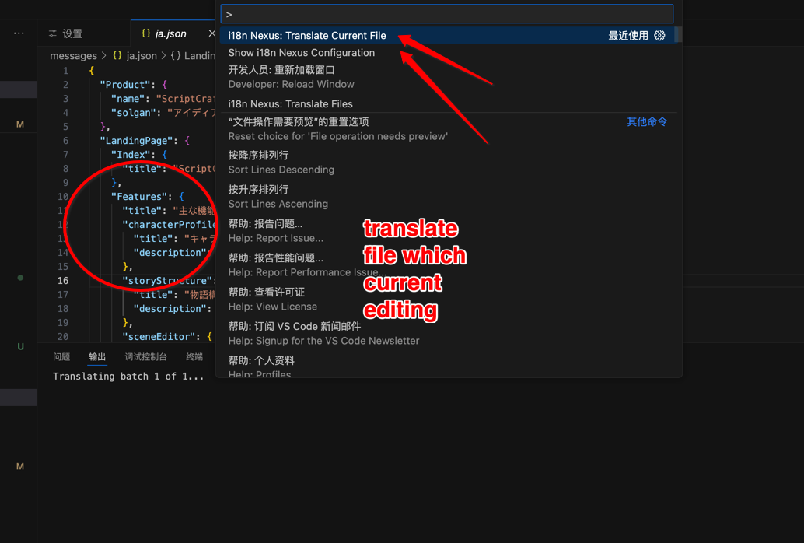
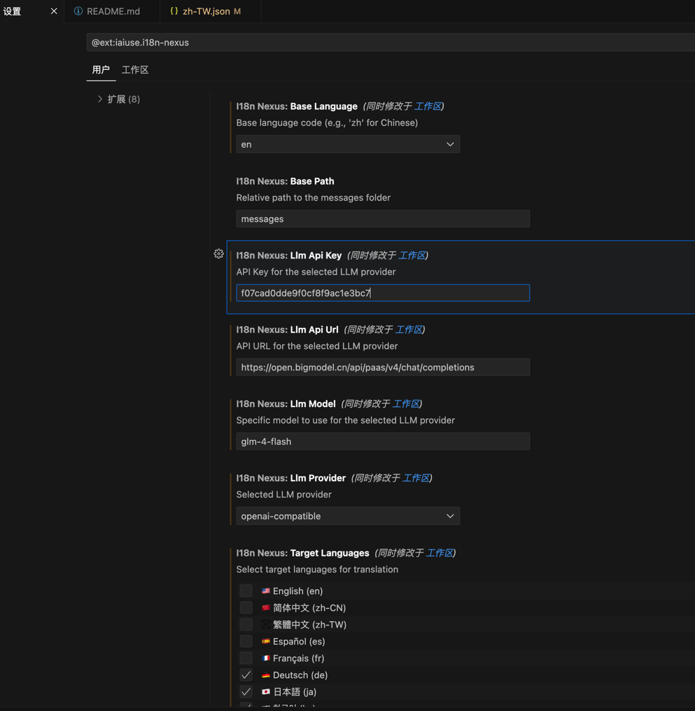
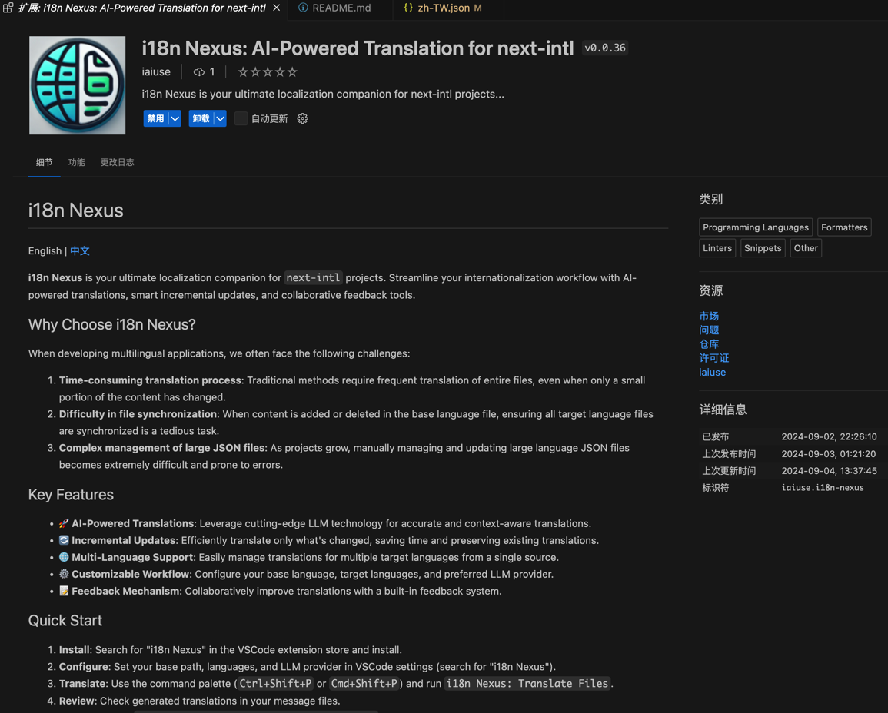
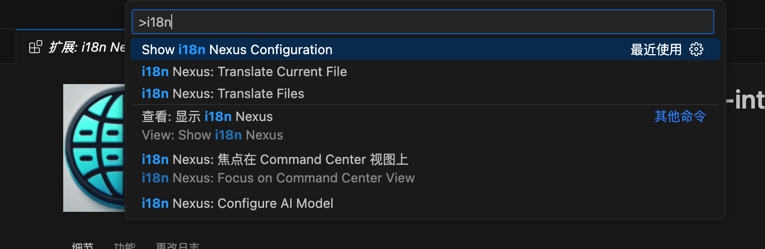
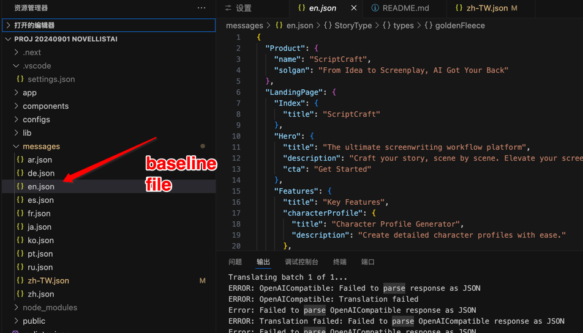

# i18n Nexus

[English](./README.md) | 中文

**i18n Nexus** 是您的 `next-intl` 项目的终极本地化助手。通过AI驱动的翻译、智能增量更新和协作反馈工具，简化您的国际化工作流程。

## 为什么选择 i18n Nexus？

在开发多语言应用时，我们经常面临以下挑战：

1. **翻译过程耗时耗力**：传统方法需要频繁翻译整个文件，即使只有小部分内容发生变化。
2. **文件同步困难**：当基准语言文件增加或删除内容时，确保所有目标语言文件同步更新是一项繁琐的工作。
3. **大型JSON文件管理复杂**：随着项目规模增长，手动管理和更新大型语言JSON文件变得极其困难且容易出错。

## 核心特性

- 🚀 **AI驱动的翻译**：利用尖端的LLM技术进行精确且上下文感知的翻译。
- 🔄 **增量更新**：高效地仅翻译已更改的内容，节省时间并保留现有翻译。
- 🌐 **多语言支持**：从单一源文件轻松管理多个目标语言的翻译。
- ⚙️ **可定制工作流**：灵活配置您的基准语言、目标语言和首选LLM提供商。
- 📝 **反馈机制**：通过内置的反馈系统协作改进翻译。

## 快速开始

1. **安装**：在 VSCode 扩展商店搜索 "i18n Nexus" 并安装。
2. **配置**：在 VSCode 设置中设置您的基本路径、语言和LLM提供商（搜索 "i18n Nexus"）。
3. **翻译**：使用命令面板（`Ctrl+Shift+P` 或 `Cmd+Shift+P`）运行 `i18n Nexus: Translate Files`。
4. **审核**：在您的消息文件中检查生成的翻译。
5. **反馈**：使用 `i18n Nexus: Provide Translation Feedback` 提出改进建议。

## 配置选项

直接在 VSCode 设置中配置 i18n Nexus：

- `i18nNexus.basePath`: 消息文件夹的相对路径。
- `i18nNexus.baseLanguage`: 基准语言代码（例如，'zh-CN' 代表中文）。
- `i18nNexus.targetLanguages`: 目标语言代码数组。
- `i18nNexus.llmProvider`: 选择的LLM提供商（例如 `openai`、`gemini` 等）。
- `i18nNexus.llmApiUrl`: 所选LLM提供商的API URL。
- `i18nNexus.llmApiKey`: LLM提供商的API密钥。

## 工作原理

i18n Nexus 使用先进的AI模型来理解和翻译您的文本。它会分析您的基准语言文件，识别新增或更改的内容，然后只对这些部分进行翻译。这种增量更新的方法既高效又能保持翻译的一致性。

## 注意事项

- 请确保妥善保管您的API密钥。
- 首次使用时，建议先在非关键项目上测试。
- AI翻译可能并不完美，建议进行人工审核。

## 反馈与贡献

欢迎为项目做出贡献或提供翻译反馈。访问我们的 [GitHub 仓库](https://github.com/iaiuse/i18n-nexus) 了解更多信息。


# i18n Nexus 使用指南

## 截图说明

### 1. 翻译当前文件


这个截图展示了如何使用i18n Nexus翻译当前编辑的文件。在VSCode的命令面板中，您可以找到"i18n Nexus: Translate Current File"选项。这个功能允许您快速翻译正在编辑的JSON语言文件，非常方便实时更新翻译。

### 2. 插件设置


这个截图显示了i18n Nexus的设置界面。您可以在这里配置以下选项：
- Base Language: 基准语言，例如'en'代表英语
- Base Path: 语言文件所在的相对路径
- LLM API Key: 用于AI翻译的API密钥
- LLM API URL: AI服务提供商的API地址
- LLM Model: 使用的具体AI模型
- LLM Provider: 选择的AI服务提供商
- Target Languages: 目标翻译语言列表

这些设置允许您自定义插件以适应您的项目需求。

### 3. 插件主页


这是i18n Nexus在VSCode扩展商店中的主页。它概述了插件的主要特性，包括AI驱动的翻译、增量更新、多语言支持等。这个页面还提供了快速开始指南，帮助新用户迅速上手使用插件。


### 4. 可用命令


这个截图展示了i18n Nexus在VSCode命令面板中的可用命令。包括：
- Show i18n Nexus Configuration: 显示插件配置
- Translate Current File: 翻译当前文件
- Translate Files: 翻译多个文件
- Focus on Command Center View: 聚焦到命令中心视图
- Configure AI Model: 配置AI模型

这些命令提供了快速访问插件各项功能的方式。


### 5. 基准文件


这个截图展示了项目中的语言文件结构。在messages文件夹中，您可以看到不同语言的JSON文件，如en.json（英语）、de.json（德语）等。其中，en.json被标记为基准文件（baseline file）。插件将基于这个文件生成其他语言的翻译。


## 总结

i18n Nexus是一个强大的VSCode插件，专为next-intl项目的本地化工作流程设计。它提供了直观的界面来配置翻译设置，支持多种语言，并利用AI技术实现高效的翻译过程。通过命令面板，用户可以轻松触发翻译任务，无论是单个文件还是整个项目。插件的设置界面允许用户自定义各种参数，以适应不同的项目需求和偏好。

## 开发者指南

### 环境要求

- Node.js (版本 14.0.0 或更高)
- VSCode (版本 1.60.0 或更高)

### 获取代码

```bash
git clone https://github.com/iaiuse/i18n-nexus.git
cd i18n-nexus
```

### 安装依赖

```bash
npm install
```

### 编译

```bash
npm run compile
```

### 运行测试

```bash
npm test
```

### 本地调试

1. 在 VSCode 中打开项目文件夹
2. 按下 F5 键启动调试
3. 在新打开的 Extension Development Host 窗口中测试插件

### 打包

```bash
npm run package
```


这将在项目根目录生成一个 `.vsix` 文件。

### 发布

1. 确保你有一个 Visual Studio Marketplace 账号
2. 登录到 [Visual Studio Marketplace 管理页面](https://marketplace.visualstudio.com/manage)
3. 点击 "New Extension" 并上传生成的 `.vsix` 文件

或者使用命令行：

```bash
npm install -g vsce
vsce publish
```

注意：发布之前，请确保已经更新了 `package.json` 中的版本号。

### 贡献指南

1. Fork 这个仓库
2. 创建你的特性分支 (`git checkout -b feature/AmazingFeature`)
3. 提交你的改动 (`git commit -m 'Add some AmazingFeature'`)
4. 推送到分支 (`git push origin feature/AmazingFeature`)
5. 开启一个 Pull Request

## 许可证

此项目使用 MIT 许可证 - 查看 [LICENSE](LICENSE) 文件了解详情。

---

加速您的全球化进程 - 让 i18n Nexus 处理本地化的复杂性，而您可以专注于为国际用户构建出色的功能！